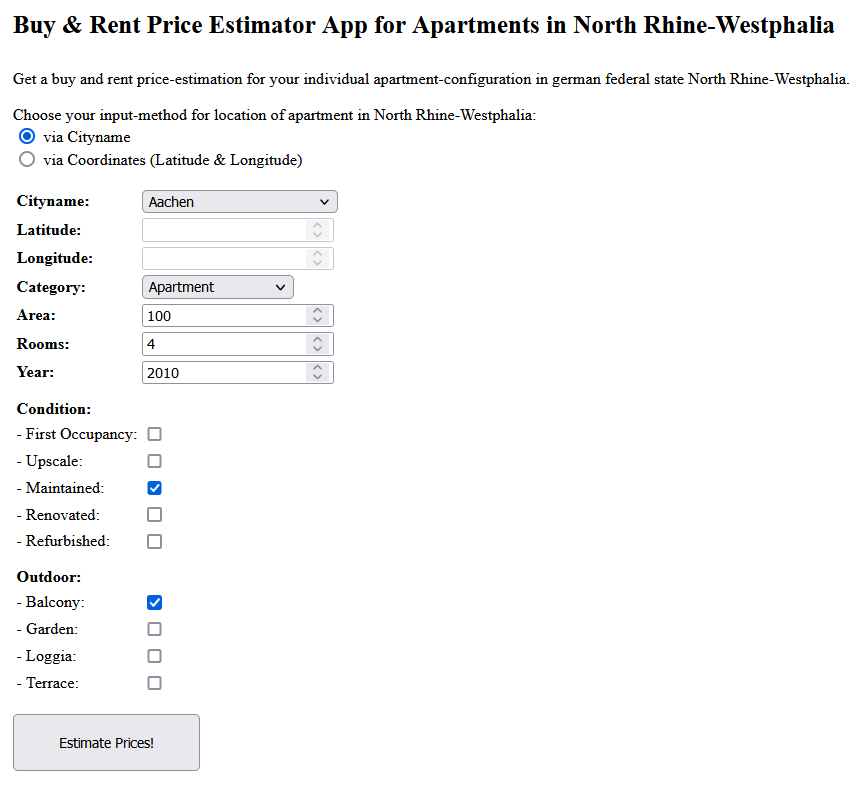
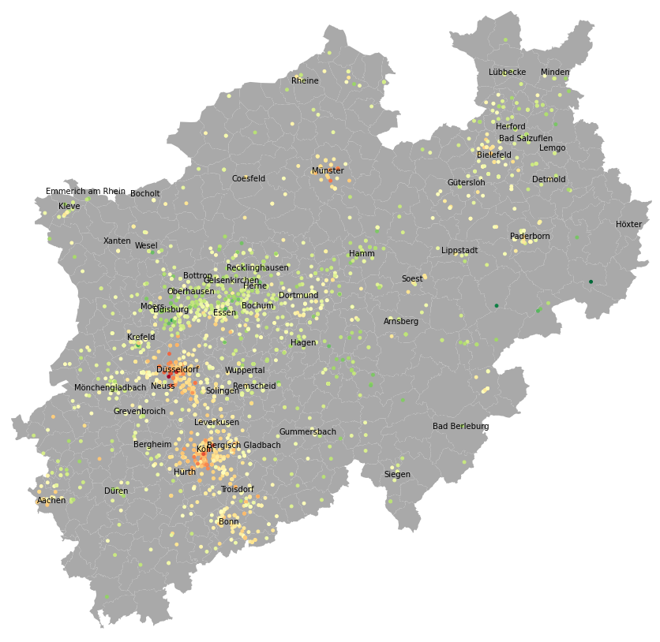
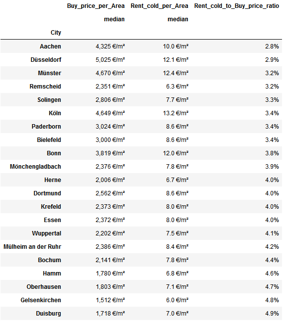
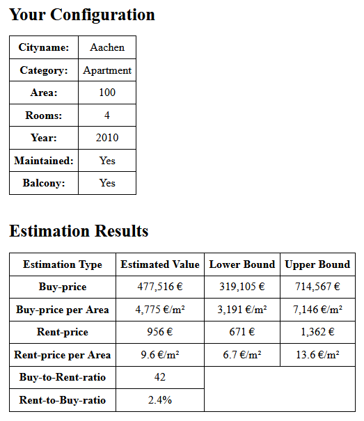

# Buy & Rent Price Estimator for Apartments

Author: <a href="https://github.com/micvolk">Michael Volk</a>

## Overview

* Built a machine learning model that estimates apartment prices for buy & rent in german federal state North Rhine-Westphalia. Model is easy usable via a web-application deployed on Heroku: [price-estimator-apartment-nrw.herokuapp.com](https://price-estimator-apartment-nrw.herokuapp.com)
* Scraped apartment-exposes data as of May 2022 from [immowelt.de](https://www.immowelt.de) (~ 3,500 for buy and ~ 4,600 for rent) with an own developed web-scraper.
* Cleaned & feature-engineered scraped data to get useful information for building the model.
* Explored the prepared data with univariate, multivariate and geographic analysis using visulisations: [micvolk.github.io/Buy-and-Rent-Price-Estimator-for-Apartments/presentation/Exploring.html](https://micvolk.github.io/Buy-and-Rent-Price-Estimator-for-Apartments/presentation/Exploring.html)
* Configured and cross-validated different machine learning models: *Random Forest Regressor, K-Nearest-Neighbors Regressor, Linear Regressors*. The best scoring model is a grid-search optimised *Random Forest Regression* model, which yields following results:
  
  | Data set | Cross-validation median relative error | Test-validation median relative error | Test-validation 90%-quantile relative error |
  | --- | --- | --- | --- |
  | buy | ~ 19% | ~ 17% | ~ 48% |
  | rent | ~ 14% | ~ 13% | ~ 43% |

* Created a comfortable user-interface for enabling individual apartment-configurations (see screenshot below) and getting price-estimates for buy & rent based on the best model. For this a web-application was developed using Flask and deployed to Heroku, which is accessible for everyone via the internet (see link at first point).

  

## Sources used
* Data source for the web-scraper: [https://www.immowelt.de](https://www.immowelt.de)
* Shapefile-map of North Rhine-Westphalia: [https://www.opengeodata.nrw.de/produkte/geobasis/vkg/dvg/dvg2/](https://www.opengeodata.nrw.de/produkte/geobasis/vkg/dvg/dvg2/)
* Thanks to Ken Jee for inspiration on how to build your own Data Science Project from scratch:
  * [https://www.youtube.com/playlist?list=PL2zq7klxX5ASFejJj80ob9ZAnBHdz5O1t](https://www.youtube.com/playlist?list=PL2zq7klxX5ASFejJj80ob9ZAnBHdz5O1t)
  * [https://github.com/PlayingNumbers/ds_salary_proj](https://github.com/PlayingNumbers/ds_salary_proj)
* Thanks to GreekDataGuy on how to build a web-application using Flask and Heroku: [https://towardsdatascience.com/productionize-a-machine-learning-model-with-flask-and-heroku-8201260503d2](https://towardsdatascience.com/productionize-a-machine-learning-model-with-flask-and-heroku-8201260503d2)

## Languages/Libraries/Tools used
* **Languages:** Python (Version 3.8.13), HTML, Javascript
* **Libraries for Python:** requests, beautifulsoup, json, pandas, geopandas, numpy, matplotlib, seaborn, sklearn, flask
* **Tools:** Anaconda, Spyder, Jupyter-Notebook, Git, Github, Heroku 

## How to run/edit this Project on your machine
* HINTS:
  * If you view this site via [micvolk.github.io/Buy-and-Rent-Price-Estimator-for-Apartments](https://micvolk.github.io/Buy-and-Rent-Price-Estimator-for-Apartments) you only see a webpage version of the GitHub repo's README.md file and you need to switch to the GitHub repo [github.com/micvolk/Buy-and-Rent-Price-Estimator-for-Apartments](https://github.com/micvolk/Buy-and-Rent-Price-Estimator-for-Apartments) to see and download the code.
  * Some defined filepaths in the modules described below may need to be manually adjusted for your machine!
* Download this repo into a directory of your choice.
* Create a new conda environment with configuration defined in *environment.yml*
* Run *executer.py* which calls the Python-modules in following order:
  * *scraping.py*: web-scraping of apartment-exposes from immowelt.de
  * *cleaning.py*: cleaning of scraped data
  * *featureEngineering.py*: feature-engineering of cleaned data
  * *trainTestSplitting.py*: splits feature-engineered data into train and test set
  * *modeling.py*: cross-validation of different machine learning models and saving the best
* *analysing.py* can be used to analyse all data created by the modules mentioned before - it loads the stored data in the created csv-/p-files back in the RAM.
* To run/edit the exploration of the feature-engineered data: open with Jupyter-Notebook *exploring.ipynb*
* To run/edit the web-application on your machine locally you need to download the files and follow the instructions given in this separate GitHub repo: [github.com/micvolk/Buy-and-Rent-Price-Estimator-for-Apartments_Web-Application](https://github.com/micvolk/Buy-and-Rent-Price-Estimator-for-Apartments_Web-Application)

## Scraping

*scraping.py* scrapes website [immowelt.de](https://www.immowelt.de/) for apartment-expose-data and collects it in separate pandas-dataframes for buy and rent, which are saved as csv-files *scraped_buy.csv*, *scraped_rent.csv*.

First the scraper collects all URLs to apartment-exposes for a given immowelt.de search result - by default all apartment-exposes for buy and rent, which are offered in german federal state North Rhine-Westphalia and have a construction year <= 2021.
Next the scraper requests for each collected URL the apartment-expose-HTML-webpage from immowelt.de with the requests-module and than parses the HTML-Code with the BeautifulSoup-module.
The embedded JSON-part of the HTML-Code contains the relevant data and gets transformed to a python-dictionary, which is than used to fill a new dictionary with the relevant apartment-data-parts. The dictionaries made in this way are collected in a list which is transformed to a pandas-dataframe and saved as a csv-file in the end - each for buy and rent.

Number of scraped apartment-exposes with default-search-setting in May 2022: ~ 3,500 for buy and ~ 4,600 for rent.

## Cleaning

*cleaning.py* cleans the dataframes created by *scraping.py* and saves them as csv-files *cleaned_buy.csv*, *cleaned_rent.csv*. Cleaning process consists of considering only columns which contain useful information and of dropping rows out of the dataframes which:
* have outliers for price, area, construction year
* have missing values in important columns
* are identical/very similiar to other apartements
* have defined blacklist-keywords in their description text like 'versteigerung', 'erbbau', 'pflegeimmobilie', ...

Number of apartment-exposes after cleaning: ~ 2,500 for buy and ~ 3,200 for rent

## Feature-Engineering

*featureEngineering.py* feature-engineers the dataframes created by *cleaning.py* and saves them as csv-files *featureEngineered_buy.csv*, *featureEngineered_rent.csv*. Also a mapping for cityname to central-coordinates of the city is performed based on a shapefile of North Rhine-Westphalia and saved as *nrwCityCoordinates.csv*.

The feature-engineering of the dataframes consists of:
* renaming columns
* one-hot-encoding of categorical columns (all columns with prefix 'equipmentArea_')
* create new calculated columns (prices per area)

## Exploring

*exploring.ipynb* explores the feature-engineered dataframes created by *featureEngineering.py* with univariate, multivariate and geographic analysis using visualisation-methods. For the geographic analysis the shapefile *shapefiles\dvg2gem_nw.shp*, containing names and borders of the administrative districts (cities) of North Rhine-Westphalia, is used.

### Sections
* First look on buy- & rent-dataframe
* Univariate Analysis
  * Descriptive statistics for each variable
  * Histograms
* Multivariate Analysis
  * Correlation-heatmap
  * Scatterplots & barplots regarding the price-variables
* Geographic Analysis
  * Apartment locations and their prices per area visualised in map of North Rhine-Westphalia
  * Comparing price-per-area and rent-to-buy-price-ratio between cities

### Main Results

* HINT: To see all results and more details please visit the rendered HTML-page of the *exploring.ipynb*-file: [micvolk.github.io/Buy-and-Rent-Price-Estimator-for-Apartments/presentation/Exploring.html](https://micvolk.github.io/Buy-and-Rent-Price-Estimator-for-Apartments/presentation/Exploring.html)
* Price and Area variables are right skewed => after log-transformation more similiar to normal-distribution
* Much more offers for rent than for buy for the 'Ruhrgebiet' region
* Strongest positive correlation between Price and Area variables, also positive correlation between Price and the variables for Number of Rooms, Construction Year and equipment features like 'Maisonette', 'Penthouse', 'First Occupancy', 'Upscale', 'Terrace' - all similar between buy and rent
* Prices per Area are high (=reddish-colored) for the 'Rhine'-Region (Düsseldorf, Köln, Bonn) with their strong economy and low (=greenish-colored) for the northern 'Ruhrgebiet'-Region (Gelsenkirchen, Recklinghausen) with their structural problems and for the districts abroad from economic centers:

  

* The difference of rent-warm per area to rent-cold per area has a low sensitivity regarding rent-warm per area and is round about 3 € per square metre.
* Cities differ in their Rent-cold to Buy-price ratio: expensive cities tend to have a low Rent-cold to Buy-price ratio and cheap cities tend to have a high Rent-cold to Buy-price ratio:

  

  * Simple interpretation: It is better to rent in cities with low Rent-cold to Buy-price ratio (like Aachen and Düsseldorf) and it is better to buy in cities with high Rent-cold to Buy-price ratio (like Gelsenkirchen and Duisburg)
  * Advanced interpretation in the framework of the [efficient-market hypothesis](https://en.wikipedia.org/wiki/Efficient-market_hypothesis) combined with the [Gordon growth model](https://en.wikipedia.org/wiki/Dividend_discount_model): There is no advantage, but also no disadvantage, to rent in cities with low Rent-cold to Buy-price ratio and vice versa because the apartment market is efficient so that there is no arbitrage-opportunity. Cities with low Rent-cold to buy-price ratio are expected to have higher future rent growth rates compared to cities with high Rent-cold to buy-price ratio => the simple interpretation can be misleading as it does not consider future rent growth rates.

## Train-Test-Splitting

*trainTestSplitting.py* splits feature-engineered dataframes created by *featureEngineering.py* into train- (80%) and test- (20%) dataframes for the models in module *modeling.py*. Dependent variable y (rent-warm-price for rent-dataframe and buy-price for buy-dataframe) and independent variables X are saved to separate files (this split is also performed for the whole dataframe). The created files are:
*X_buy.csv*, *X_train_buy.csv*, *X_test_buy.csv*, *y_buy.csv*, *y_train_buy.csv*, *y_test_buy.csv*,
*X_rent.csv*, *X_train_rent.csv*, *X_test_rent.csv*, *y_rent.csv*, *y_train_rent.csv*, *y_test_rent.csv*

OPTIONAL: Function *add_nearestApartments_medianPrice_forModel()* can be used to create a new column with a price-estimate for every apartment based on its nearest-neighboors-apartments in the train-dataframes.
That created column can be used as a independet variable in Linear Regression models in module *modeling.py*, as they are unable to handle the complicated non-linear relationship between coordinates-information (Latitude, Longitude) and the dependent-variable (buy-/rent-price).
But by default this function is deactivated (but can easily be activated) because its very time-intensive to calculate and all in all the Linear Regression models are beaten by the *Random Forest Regression* and *K-Nearest Neighbors Regression* models, which also work well without that created independent variable (see next chapter Modeling for details).

## Modeling

*modeling.py* cross-validates different machine learning models based on the train-test-dataframes created by *trainTestSplitting.py* and saves the best model, each for buy and rent, together with performance-measures as pickle-files *model_buy.p*, *model_rent.p*. These best models are the basis for the developed web-application deployed on Heroku (see section [Productionization: Web-Application](#productionization)).

### Machine learning model types considered
* *[Random Forest Regression](https://en.wikipedia.org/wiki/Random_forest)*
* *[K-Nearest Neighbors Regression](https://en.wikipedia.org/wiki/K-nearest_neighbors_algorithm#k-NN_regression)*
* *[Linear Regression](https://en.wikipedia.org/wiki/Linear_regression)*

Arguments for having choosen these machine learning model types by taking into account the characteristics of the train-test-dataframes:
  * many independent variables in the train-test-dataframes:
    * no problem for *Random Forest Regression* model
    * can be problematic for *K-Nearest Neighbors Regression* model because of [curse of dimensionality](https://en.wikipedia.org/wiki/Curse_of_dimensionality) and for *Linear Regression* model because of tendence to overfitting => may be healed by identifying and choosing only the variables with most explanatory power
  * complicated non-linear relationship between coordinates-information (Latitude, Longitude) and the dependent-variable (buy- / rent-price) in train-test-dataframes:
    * no problem for *Random Forest Regression* model and *K-Nearest Neighbors Regression* model
    * problematic for *Linear Regression* model as it can not handle the complicated non-linear relationships => may be healed by using a created proxy-variable for coordinates information, which is created in module *trainTestSplitting.py*: price-estimate for every apartment based on its nearest-neighboors-apartments in the train-dataframes
  * time needed to train the model:
    * *K-Nearest Neighbors Regression* model needs no training-time
    * but training-time is very short for both other models (except grid-search for best model-configuration) and so not really relevant at all
  * interpretability:
    * good for *Linear Regression* model and *K-Nearest Neighbors Regression* model
    * hard for *Random Forest Regression* model

For all machine learning model types different configurations regarding considered independent variables and transformation/scaling  are trained and tested. For the best performing model-configuration also grid-search regarding the most promising parameters is performed (=hyperparameter-optimisation). For more details see section [Results](#results).

### Transformations and Scaling

The dependent variable y (rent-warm-price for rent-dataframe and buy-price for buy-dataframe) is log-transformed to enable equal-weighting relative erros between predicted and real value and to give not to much weight on outliers. Also for many model-configurations the independent variables Area and Rooms are log-transformed as they get more normally distributed => helpfull for *Linear Regression* models.
Moreover standard-scaling (= x - mean / standard deviation) is performed for many model-configurations: Specially the *K-Nearest Neighbors Regression* models benefit from standard-scaling of the independent variables as they are reliant on uniform units of measure between the independent variables to make meanigful distance-measure possible.

### Validation-Method

Every model gets cross-validated based on the train-data (80%) with 3 folds. The scoring-method used for the cross-validation is median-absolute-error of the log-transformed dependent variable (not mean-absolute- or squared-error to give not to much weight on outliers). The model with the best score over the 3 cross-validation-folds gets pickled to be used in the web-application (each for rent and buy). Also all models are separately validated based on the test-data (20%) - these validation results are used in the web-application to show a confidence-intervall of the predicted rent and buy price.

### Results
* *Random Forest Regression* models have best cross-validation and test-validation scores of all considered model types - each for buy and rent. The best *Random Forest Regression* model yields following results:
  
  | Data set | Cross-validation median relative error | Test-validation median relative error | Test-validation 90%-quantile relative error |
  | --- | --- | --- | --- |
  | buy | ~ 19% | ~ 17% | ~ 48% |
  | rent | ~ 14% | ~ 13% | ~ 43% |
  
  Interestingly also clearly different configurations of the *Random Forest Regression* models yield nearly the same results as the best *Random Forest Regression* model:
  * it nearly does not matter if all independet variables or if only a subset of the independent variables containing Latitude, Longitude, Area, Construction-Year are used. Only when this subset is further reduced the result gets worser => the variables Latitude, Longitude, Area, Construction-Year have by far the most prediction power for the model, the influence of the other independent variables is negligible. 
  * also it nearly does not matter if a standard-scaling and log-transformation of the independent variables is performed => not surprising since in general *Random Forest Regression* models do not benefit from such scaling/transformation.
  * the best *Random Forest Regression* model was optimised using Grid-Search regarding the most promising parameters: number of decision trees (50 to 200), function to measure the quality of a split (squared error vs. absolute error), minimum number of samples required to be at a leaf node (1 to 3). This optimisation yielded only marginally better results in cross-validation and even marginally worser results in test-validation => no benefit of using resource-intensive grid-search for hyperparameter-tuning of *Random Forest Regression* model.

* *K-Nearest Neighbors Regression* model, only with the independent variables subset Latitude, Longitude, Area, Construction-Year (all standard-scaled), performs slightly worser than the best *Random Forest Regression* model:
  
  | Data set | Cross-validation median relative error | Test-validation median relative error | Test-validation 90%-quantile relative error |
  | --- | --- | --- | --- |
  | buy | ~ 21% | ~ 19% | ~ 60% |
  | rent | ~ 15% | ~ 15% | ~ 45% |
  
  In contrast to the *Random Forest Regression* models a configuration with all independent variables (all standard-scaled) performs much worser => probable reason: the [curse of dimensionality](https://en.wikipedia.org/wiki/Curse_of_dimensionality), e.g. to much independent variables in relation to training-data-size makes predictions worser for distance-measure-based models like *K-Nearest Neighbors Regression* because the vector-room becomes to sparsely populated.

* *Linear Regression* models perform worser than the best *Random Forest Regression* and *K-Nearest Neighbors Regression* model. The best *Linear Regression* model, which is based on all independent variables standard scaled and moreover variables Area and Rooms are log-transformed, yields following results:
  
  | Data set | Cross-validation median relative error | Test-validation median relative error | Test-validation 90%-quantile relative error |
  | --- | --- | --- | --- |
  | buy | ~ 27% | ~ 26% | ~ 89% |
  | rent | ~ 17% | ~ 16% | ~ 54% |

  The *Linear Regression* models have the disadvantage, that they are unable to handle the complicated non-linear relationship between coordinates-information (Latitude, Longitude) and the dependent-variable (buy-/rent-price) - they can only differentiate between more north/south and more west/east, which is to rough to handle the geographic price-distribution in North Rhine-Westphalia (compare map in section Exploring).
Therefore on an experimental basis a proxy-variable for the coordinates-information has been feature-engineered in the module *trainTestSplitting.py*: The function *add_nearestApartments_medianPrice_forModel()* creates a new column (=new independent variable) with a price-estimate for every apartment based on its nearest-neighboors-apartments in the train-dataframes (Median Price per area of the n nearest apartments multiplied with Area) - unfortunately, the calculation of the function in its current form takes a lot of time.
Adding this created variable as a independent variable to the best (until then) *Linear Regression* model yields much better results:
  
  | Data set | Cross-validation median relative error | Test-validation median relative error | Test-validation 90%-quantile relative error |
  | --- | --- | --- | --- |
  | buy | ~ 21% | ~ 21% | ~ 62% |
  | rent | ~ 14% | ~ 15% | ~ 45% |
  
  Thus with this added variable the best *Linear Regression* model is almost as good as the best *Random Forest Regression* and *K-Nearest Neighbors Regression* model without that variable. Adding this variable also to these models improves their results only a little - that is not surprising as the *Random Forest Regression* and *K-Nearest Neighbors Regression* model can already handle Coordinates-information (Latitude and Longitude) in a meaningful way and thus the added proxy-variable for the coordinates-information can not add much explantory value to these models anymore. Because of the long calculation-time for the proxy-variable, and the relatively low added value for the already good predicting *Random Forest Regression* and *K-Nearest Neighbors Regression* models, the proxy-variable will not be calculated by default in module *trainTestSplitting.py*.

## Productionization: Web-Application
* To easily use the best model for estimating buy & rent prices for individual apartment-configurations I created a web-application *app.py* using Flask and deployed it to Heroku. It has a comfortable user-interface and is accessible for everyone via the internet by calling this link: [price-estimator-apartment-nrw.herokuapp.com](https://price-estimator-apartment-nrw.herokuapp.com)
* By calling the link, the user automatically sends a request to the *app.py* deployed to Heroku, which then returns an HTML-input-formular to specify the desired apartment-configuration:

  

* After filling out the formular and hitting the submit-button the formular-input is sent to the app via a POST-request. Then a buy & rent price estimation is performed, which is based on the formular-input-data and the deposited best model (*model_buy.p*, *model_rent.p*) created by *modeling.py*. The buy- & rent-estimation-values together with associated confidence-intervalls, which are derived from the relative error distribution of the model-test-validation, are then returned via a new HTML-page:

  

* Code, detailed description and related files of the app are stored in this GitHub repo: [github.com/micvolk/Buy-and-Rent-Price-Estimator-for-Apartments_Web-Application](https://github.com/micvolk/Buy-and-Rent-Price-Estimator-for-Apartments_Web-Application)

